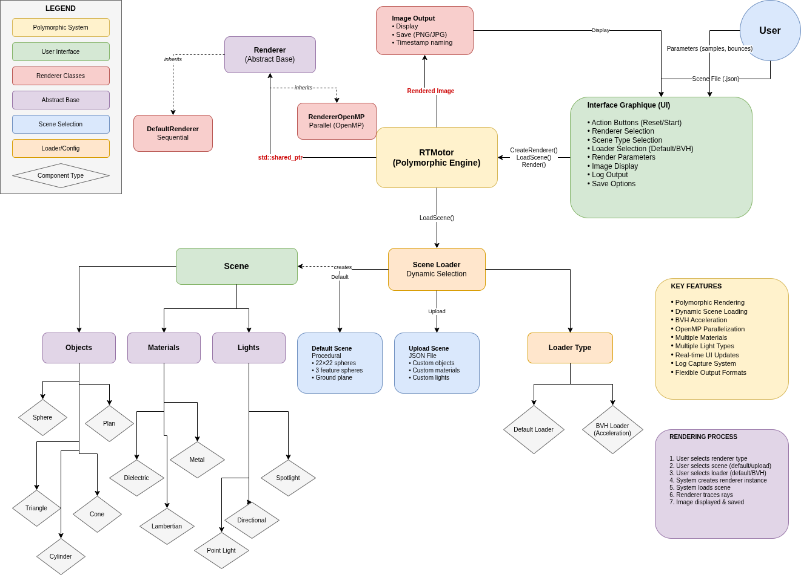
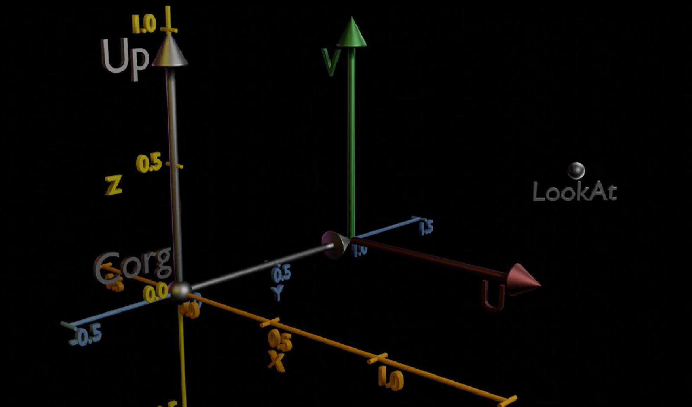
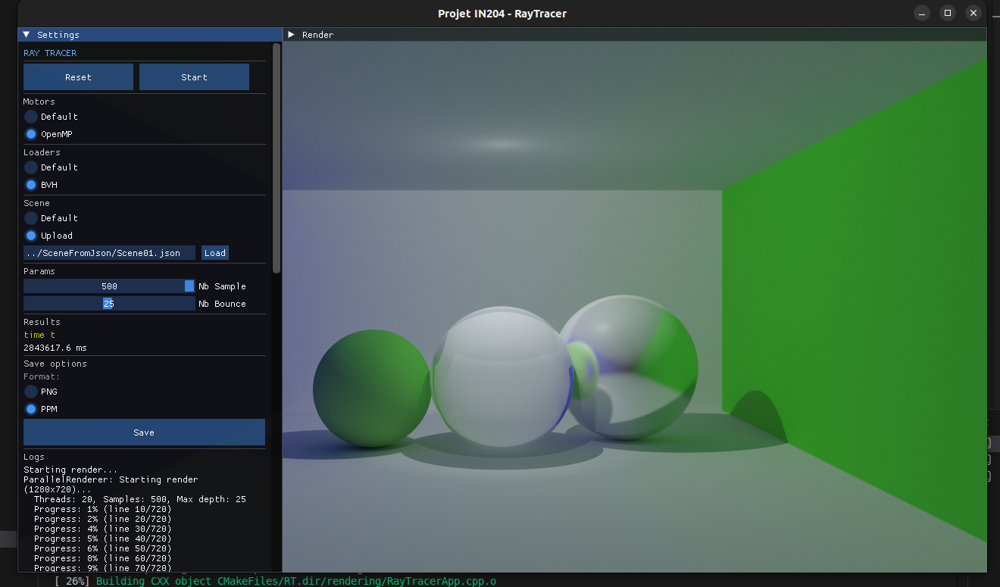
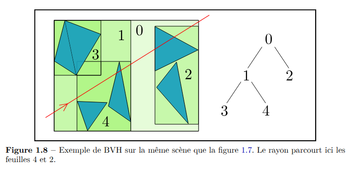

# Ray Tracer (RT) - IN204

Un moteur de rendu par lancer de rayons (Ray Tracing) développé en C++ moderne, basé sur la série *Ray Tracing in One Weekend* et sur le modèle d'un ainé académique. Ce projet utilise SDL2 et ImGui pour l'affichage et l'interface en temps réel du rendu. 

---

## Analyse Fonctionnelle

### Objectif Global
Ce projet a pour objectif de mettre en place un moteur de ray tracing capable de :
- Générer des images photoréalistes grâce à la technique du lancer de rayons
- Modéliser des scènes 3D avec différents types d'objets géométriques
- Appliquer des matériaux réalistes (Lambertien, métallique, diélectrique)
- Gérer l'éclairage via des sources lumineuses (directionnelle, ponctuelle, spot)
- Optimiser le rendu via parallélisation multi-thread (OpenMP) et structure de hiérarchie BVH
- Visualiser en temps réel et interagir via une interface ImGui

### Fonctionnalités Principales

1. Rendu par Ray Tracing
   - Lancer de rayons depuis la caméra à travers chaque pixel
   - Calcul d'intersection ray-objet
   - Récursion pour les réflexions et réfractions

2. Objets Géométriques
   - Sphères, Plans, Cylindres, Cônes
   - Triangles et Mailles (Mesh)
   - Parallélépipèdes rectangles
   - Hiérarchie BVH pour l'accélération

3. Matériaux et Lumière
   - Matériaux Lambertiens (diffus)
   - Matériaux Métalliques avec rugosité
   - Matériaux Diélectriques (verre, transparent)
   - Sources lumineuses : directionnelle, ponctuelle, spotlights

4. Interactivité
   - Interface ImGui pour configurer la scène
   - Sauvegarde de rendus en format PPM
   - Contrôle des paramètres en temps réel

**Flowchart du système :**

---

## Principes de Ray Tracing

### Ray Tracing Basique

Le **ray tracing** (lancer de rayons) est une technique de rendu qui simule le comportement de la lumière pour générer des images photoréalistes. 

**Principe fondamental :**
Pour chaque pixel de l'image, on lance un rayon depuis la caméra à travers ce pixel dans la scène. Pour chaque rayon :

1. **Détection d'intersection** : On trouve l'objet le plus proche que le rayon frappe
2. **Calcul d'illumination** : On calcule la contribution de la lumière à ce point (couleur, ombre, réflexion)
3. **Récursion** : Si le matériau est réfléchissant ou transparent, on lance des rayons secondaires
4. **Accumulation** : On accumule les contributions jusqu'à une profondeur maximale

**Équation de base :**
$$C_{pixel} = \int_{hemisphere} L(direction) \cdot BRDF \cdot \cos(\theta) \, d\omega$$

Où :
- $L(direction)$ = luminosité en provenance de cette direction
- $BRDF$ = fonction de réflectance du matériau
- $\cos(\theta)$ = angle d'incidence

**Exemple de processus :**
```
Pixel (x, y) 
  └─> Rayon primaire (camera -> pixel)
      ├─> Intersection avec objet
      ├─> Calcul ombrage direct (lights)
      ├─> Si réfléchissant : Rayon de réflexion
      │   └─> Récursion...
      └─> Si transparent : Rayon de transmission
          └─> Récursion...
```



### Accélération avec BVH (Bounding Volume Hierarchy)

Le problème majeur du ray tracing basique : pour **chaque rayon**, on doit tester l'intersection avec **tous les objets** de la scène. Avec $n$ rayons et $m$ objets, c'est $O(n \times m)$ opérations !

Pour une image 500×500 = 250 000 pixels, avec 100 samples par pixel = 25 millions de rayons. Avec 10 000 objets, cela représente **250 milliards** d'intersections à calculer. **Sans optimisation, c'est impossible.**

**Solution : BVH (Hiérarchie de Volumes Englobants)**

La BVH organise les objets dans une **structure arborescente hiérarchique** où chaque nœud contient une boîte englobante (AABB : Axis-Aligned Bounding Box).

**Principe :**
1. **Pré-traitement** : On construit récursivement un arbre binaire
   - Trier les objets selon un axe (X, Y ou Z) choisi aléatoirement
   - Diviser la liste en deux moitiés
   - Créer récursivement les sous-arbres gauche et droit
   - Calculer la boîte englobante (AABB) qui englobe les enfants
2. **Traversée hiérarchique** : Pour chaque rayon, on teste d'abord si le rayon intersecte la boîte englobante
3. **Élagage rapide** : Si le rayon ne frappe pas la boîte, on ignore tous les objets à l'intérieur (élagage entier du sous-arbre)

**Structure BVH :**
```
                   AABB (root - toute la scène)
                  /                    \
         AABB (gauche)          AABB (droite)
        /          \              /          \
    AABB      AABB         AABB         AABB
    / \        / \           / \         / \
   O1 O2      O3 O4        O5 O6       O7 O8
```

**Comparaison de performance :**

| Méthode | Complexité | Rayons | Objets | Opérations |
|---------|-----------|--------|--------|------------|
| Sans BVH (hittable_list) | $O(n \times m)$ | 25M | 10k | 250B ❌ |
| Avec BVH | $O(n \times \log m)$ | 25M | 10k | 130M ✅ |

**Gain : ~1000× plus rapide !**

#### Implémentation dans le Projet

**Structure AABB (Axis-Aligned Bounding Box) :**
- Stocke 3 intervalles (x, y, z) pour les bornes min/max
- Méthode `hit()` utilise l'algorithme du "slab" pour tester l'intersection rayon-AABB
- Les comparateurs trient les objets selon les axes (SAH - Split Along Heuristic)

**Construction BVH :**
```cpp
// Constructeur récursif
bvh_node(const std::vector<std::shared_ptr<hittable>>& src_objects, size_t start, size_t end) {
    // Choix aléatoire d'axe de division
    int axis = random_int(0, 2);  // X, Y ou Z
    
    // Tri des objets selon leur AABB sur cet axe
    std::sort(objects.begin() + start, objects.begin() + end, comparator);
    
    // Division en deux moitiés
    auto mid = start + object_span / 2;
    left = std::make_shared<bvh_node>(objects, start, mid);    // Sous-arbre gauche
    right = std::make_shared<bvh_node>(objects, mid, end);     // Sous-arbre droit
    
    // Boîte englobante : union des deux enfants
    bbox = aabb(left->bounding_box(), right->bounding_box());
}
```

**Traversée BVH :**
```cpp
bool hit(const Ray& r, double* ray_tmin, double* ray_tmax, hit_record& rec) const override {
    // 1. Tester si le rayon intersecte la boîte englobante
    if (!bbox.hit(r, interval(*ray_tmin, *ray_tmax)))
        return false;  // Élagage : ignorer tout le sous-arbre
    
    // 2. Tester les enfants
    bool hit_left = left->hit(r, ray_tmin, ray_tmax, rec);
    
    // 3. Optimisation : si on a frappé à gauche, limiter la recherche à droite
    //    (pas besoin de tester des objets plus loin que l'intersection gauche)
    double new_tmax = hit_left ? rec.t : *ray_tmax;
    bool hit_right = right->hit(r, ray_tmin, &new_tmax, rec);
    
    return hit_left || hit_right;
}
```

**Utilisation :**
```cpp
// Dans Scene, on peut wrapper la liste d'objets avec BVH
hittable_list world;
// ... ajouter des objets ...
auto accelerated_world = std::make_shared<bvh_node>(world);

// La BVH remplace la traversée linéaire
world.hit(ray, ...)  // O(m) - teste tous les objets
accelerated_world->hit(ray, ...)  // O(log m) - élagage hiérarchique
```

#### Exemple Visual - Images de Rendu

**Rendu simple (100 samples, 10 bounces) :**


**Rendu haute qualité (500 samples, 25 bounces) :**


**Structure BVH Visualisée :**


**Avantages de la BVH :**
-  Construction rapide $O(n \log n)$ par tri et division récursive
- Accès cache-efficace (arbre binaire)
- Simple à implémenter et paralléliser avec OpenMP
- Élagage très efficace dans les cas réalistes (majorité des rayons)
- Méthode du "slab" très rapide pour tester AABB

**Implémentation dans le projet :**
- [dependencies/objects/_bvh_node.hpp](dependencies/objects/_bvh_node.hpp) - Construction et traversée BVH
- [dependencies/objects/_AABB.hpp](dependencies/objects/_AABB.hpp) - Boîte englobante et test d'intersection

---

## Structure des Dossiers

### `/dependencies`
Contient tous les modules de base du moteur :

#### `camera/`
- Ray.hpp/cpp : Structure d'un rayon avec origine et direction
- Camera.hpp/cpp : Gestion de la caméra, génération des rayons
- Contient les calculs de transformations d'espace

#### `lights/`
- Light.hpp/cpp : Classe abstraite de base pour les lumières
- DirectionalLight.hpp/cpp : Lumière directionnelle (like sun)
- PointLight.hpp/cpp : Lumière ponctuelle (ampoule)
- SpotLight.hpp/cpp : Lumière avec cône de diffusion
- Light_list.hpp/cpp : Gestionnaire de liste de lumières

#### `materials/`
- Material.hpp/cpp : Classe abstraite pour les matériaux
- Lambertian.hpp/cpp : Matériau diffus (mur, papier)
- Metal.hpp/cpp : Matériau réfléchissant avec rugosité
- Dielectric.hpp/cpp : Matériau transparent (verre, eau)
- Implémentent le comportement de la lumière sur les surfaces

#### `objects/`
- _Generic.hpp : Classe `hittable` abstraite et `hit_record` (intersection)
- Sphere.hpp/cpp : Objet sphérique
- Plan.hpp/cpp : Plan infini
- Triangle.hpp/cpp : Triangle simple
- Cylinder.hpp/cpp : Cylindre
- Cone.hpp/cpp : Cône
- Parallepiped.hpp/cpp : Boîte rectangulaire
- Mesh.hpp/cpp : Maille composée de triangles
- _Hittable_object_list.hpp/cpp : Conteneur d'objets
- _AABB.hpp : Boîte englobante (Axis-Aligned Bounding Box)
- _bvh_node.hpp : Hiérarchie BVH pour accélération

#### `RTMotors/`
- Renderer.hpp/cpp : Classe abstraite pour les moteurs de rendu
- SimpleRenderer.hpp/cpp : Rendu simple (mono-thread)
- ParallelRenderer.hpp/cpp : Rendu parallélisé avec OpenMP
- Contient la logique principale du ray tracing

#### `scene/`
- scene.hpp/cpp : Gestion de la scène (objets + lumières)
- SceneLoader.hpp/cpp : Chargement depuis fichiers JSON

#### `utils/`
- Vector3.hpp : Classe 3D vectorielle (position, direction, couleur)
- Image.hpp/cpp : Gestion des images en mémoire
- ColorUtils.hpp : Utilitaires de manipulation de couleur
- Random.hpp : Générateur de nombres aléatoires

### `/rendering`
Interface avec le système :
- RayTracerApp.hpp/cpp : Application principale SDL2/ImGui
- Gère la fenêtre, les événements, la boucle de rendu
- Intégration de l'interface utilisateur

### `/external`
- imgui/ : Interface utilisateur Dear ImGui (submodule)
- Permet la configuration interactive

### `/SceneFromJson`
- **Scene01.json, Scene02.json** : Fichiers de description de scènes
- Format JSON pour la sérialisation

### `/build`
- Dossier généré par CMake contenant l'exécutable compilé

---

## Installation et Compilation

### Prérequis
- Compilateur C++ (g++ ou clang) supportant C++17
- CMake en version 3.22 ou supérieure
- Bibliothèque SDL2
- OpenMP pour la parallélisation

Sur **Ubuntu/Debian/WSL** :
```bash
sudo apt update
sudo apt install build-essential cmake libsdl2-dev libomp-dev
```

Sur **Fedora** :
```bash
sudo dnf install gcc-c++ cmake SDL2-devel libomp-devel
```

Sur **macOS** (avec Homebrew) :
```bash
brew install cmake sdl2 libomp
```

### Compilation
```bash
cd /home/naps/Documents/Ensta/POO/projetIN204
mkdir -p build
cd build
cmake ..
make [-j$(nproc)]
```

Le binaire `RT` sera généré dans le dossier `build/`.

---

## Lancement et Utilisation

### Exécution
```bash
cd build
./RT
```

### Interface Utilisateur

Une fenêtre SDL2 s'ouvrira avec :
1. **Fenêtre de rendu** : Affichage du ray tracing en temps réel
2. **Panneau ImGui** (côté droit) :
   - **Scene Controls** : Sélection et configuration de la scène
   - **Render Settings** : Paramètres de rendu
     - Nombre d'échantillons par pixel (samples)
     - Profondeur de récursion (max bounces)
   - **Camera Controls** : Position et orientation de la caméra
   - **Material Selection** : Choix des matériaux

### Interaction avec les Scènes
Les scènes JSON peuvent être chargées pour initialiser des configurations pré-définies :
```json
{
  "objects": [
    {"type": "sphere", "center": [0, 0, 0], "radius": 1.0, "material": "lambertian"}
  ],
  "lights": [
    {"type": "directional", "direction": [1, 1, 1], "intensity": 1.0}
  ]
}
```

---

## Architecture et Design Patterns

### Patterns Utilisés
- **Héritage polymorphe** : Classes abstraites `hittable`, `Material`, `Light`, `Renderer`
- **Composition** : `Scene` contient des listes d'objets et de lumières
- **Strategy** : Différents types de renderers (Simple, Parallel)
- **Factory** : Création d'objets via le loader JSON

### Hiérarchie des Classes

```
hittable (abstract)
├── Sphere
├── Plan
├── Triangle
├── Cylinder
├── Cone
├── Parallepiped
├── Mesh
├── hittable_list
└── bvh_node (acceleration structure)

Material (abstract)
├── Lambertian
├── Metal
└── Dielectric

Light (abstract)
├── DirectionalLight
├── PointLight
└── SpotLight

Renderer (abstract)
├── SimpleRenderer
└── ParallelRenderer
```

---

## Axes d'Amélioration

### 1. Fonctionnalités de Rendu
- Implémenter le texture mapping avec coordonnées UV
- Ajouter les normales maps pour détails de surface
- Support des maps d'environment (HDRI)
- Denoising post-rendu (filtre temporal, ML-based)
- Depth of field et motion blur
- Caustics et effets sub-surface scattering

### 2. Performance
- Implémenter le GPU ray tracing (CUDA, OptiX)
- Spatial partitioning plus avancé (KD-tree, Octree)
- Caching des rayons tracés
- Progressive rendering avec refinement itératif
- Optimisation du memory bandwidth

### 3. Format et Export
- Export en PNG et JPEG (actuellement PPM uniquement)
- Support des formats OpenEXR (HDR)
- Export en multi-pass (normal map, depth, albedo)
- Sauvegarde des paramètres de rendu

### 4. Scénographie et Assets
- Import de modèles OBJ, FBX, glTF
- Gestionnaire de ressources Assets
- Bibliothèque de matériaux pré-définis
- Éditeur visuel de scène intégré
- Support du skeletal animation

### 5. Interface Utilisateur
- Viewport 3D interactif pour éditer la scène
- Gizmos pour transformer les objets (translate, rotate, scale)
- Real-time preview au niveau de la caméra
- Histogramme et statistiques de luminance
- Undo/Redo système

### 6. Optimisations Mathématiques
- SIMD vectorization (SSE, AVX)
- Half-precision floats pour certains calculs
- Approximations pour fonctions trigonométriques lentes

### 7. Testing et Qualité
- Unit tests pour les intersections géométriques
- Tests de convergence du ray tracer
- Benchmarking de performance
- Validation contre des références (Arnold, V-Ray)

### 8. Documentation et Exemples
- Tutoriels pas à pas
- Galerie de scènes d'exemple
- Documentation des APIs internes
- Contribution guide pour développeurs

---

## Bibliographies

### Livres de Référence
1. **"Ray Tracing in One Weekend"** - Peter Shirley (Series)
   - Fondation du projet, algorithmes de base
   - Accessible et progressive

2. **"Physically Based Rendering"** - Matt Pharr, Wenzel Jakob, Greg Humphreys (3rd Edition, 2016)
   - Bible du ray tracing physiquement basé
   - Couvre BSDF, spectral rendering, advanced techniques
   - https://www.pbrt.org/

3. **"Ray Tracing Gems"** - Eric Haines & Tomas Akenine-Möller (Series)
   - Collections d'articles pratiques et optimisations
   - Techniques récentes et applications réelles

### Articles Académiques et Resources Web
4. **"An Introduction to Ray Tracing"** - Andrew S. Glassner
   - Classique académique complet
   - Géométrie et algorithmes fondamentaux

5. **Real-Time Rendering (4th Edition)** - Möller, Haines, Hoffman (2018)
   - Couvre ray tracing et rasterization
   - Modern graphics pipeline

6. **NVIDIA OptiX Documentation**
   - Reference pour GPU ray tracing
   - Patterns d'optimisation parallèle

### Ressources en Ligne
- **Path Tracing Series** - YouTube, travaux académiques
- **Daniel Github code** (https://github.com/DanielFrulane/Ray-Tracer-Application /) - 

### Implémentation Spécifique
7. **"BVH Acceleration Structures"** - Akenine-Möller et al.
   - Essentiellement dans PBRT et Ray Tracing Gems

8. **"Importance Sampling for Monte Carlo Path Tracing"**
   - Variance reduction techniques
   - Critical for efficient rendering

### Outils et Frameworks
- OpenMP Documentation - Parallélisation multicore
- SDL2 Documentation - Graphics display and events
- Dear ImGui - https://github.com/ocornut/imgui

### Ressources Locales
Les documents suivants sont disponibles dans le dossier `/ressources` du projet :

9. "Object-Oriented Ray-Tracing" (2023)
   - Approche orientée objet du ray tracing
   - Architecture logicielle et design patterns
   - Directement applicable au projet

10. Thèse - Lancelot Perrotte (2011)
    - Recherche académique en informatique graphique
    - Fondements théoriques du ray tracing
    - Optimisations et techniques avancées

---

## État Actuel et Changelog

### Fonctionnalités Implémentées
- Ray tracing basique avec intersections géométriques
- Plusieurs types d'objets géométriques (sphère, plan, triangle, etc.)
- Trois types de matériaux (Lambertian, Metal, Dielectric)
- Sources lumineuses (directionnelle, ponctuelle, spotlight)
- Accélération BVH pour performances
- Parallélisation multi-thread (OpenMP)
- Visualisation SDL2 + ImGui
- Sauvegarde en PPM
- Chargement de scènes JSON

### En Cours
- Refactoring architecture Renderer/Scene
- Optimisations de performance

### À Faire
- Texture Mapping / UV coordinates
- Export PNG/JPEG
- Éditeur visuel complet
- GPU ray tracing

---

## Contributeurs
Projet pédagogique ENSTA - IN204 (Programmation Orientée Objet)

## Licence

The MIT License (MIT)

Copyright (c) 2014-2026 Omar Cornut

Permission is hereby granted, free of charge, to any person obtaining a copy of this software and associated documentation files (the "Software"), to deal in the Software without restriction, including without limitation the rights to use, copy, modify, merge, publish, distribute, sublicense, and/or sell copies of the Software, and to permit persons to whom the Software is furnished to do so, subject to the following conditions:

The above copyright notice and this permission notice shall be included in all copies or substantial portions of the Software.

THE SOFTWARE IS PROVIDED "AS IS", WITHOUT WARRANTY OF ANY KIND, EXPRESS OR IMPLIED, INCLUDING BUT NOT LIMITED TO THE WARRANTIES OF MERCHANTABILITY, FITNESS FOR A PARTICULAR PURPOSE AND NONINFRINGEMENT. IN NO EVENT SHALL THE AUTHORS OR COPYRIGHT HOLDERS BE LIABLE FOR ANY CLAIM, DAMAGES OR OTHER LIABILITY, WHETHER IN AN ACTION OF CONTRACT, TORT OR OTHERWISE, ARISING FROM, OUT OF OR IN CONNECTION WITH THE SOFTWARE OR THE USE OR OTHER DEALINGS IN THE SOFTWARE.

